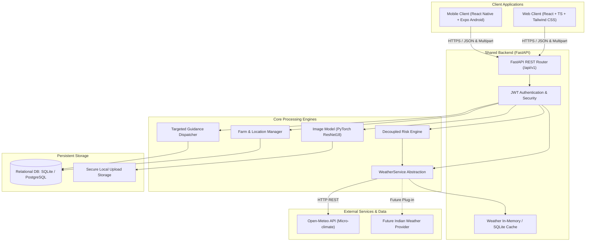
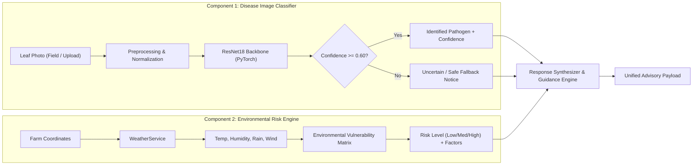
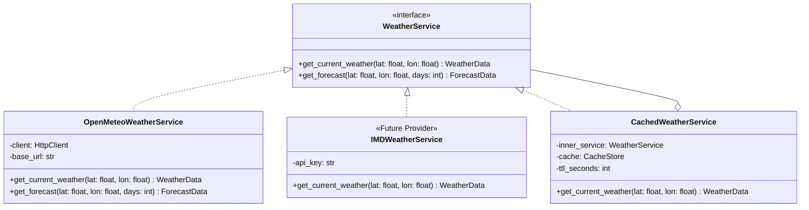
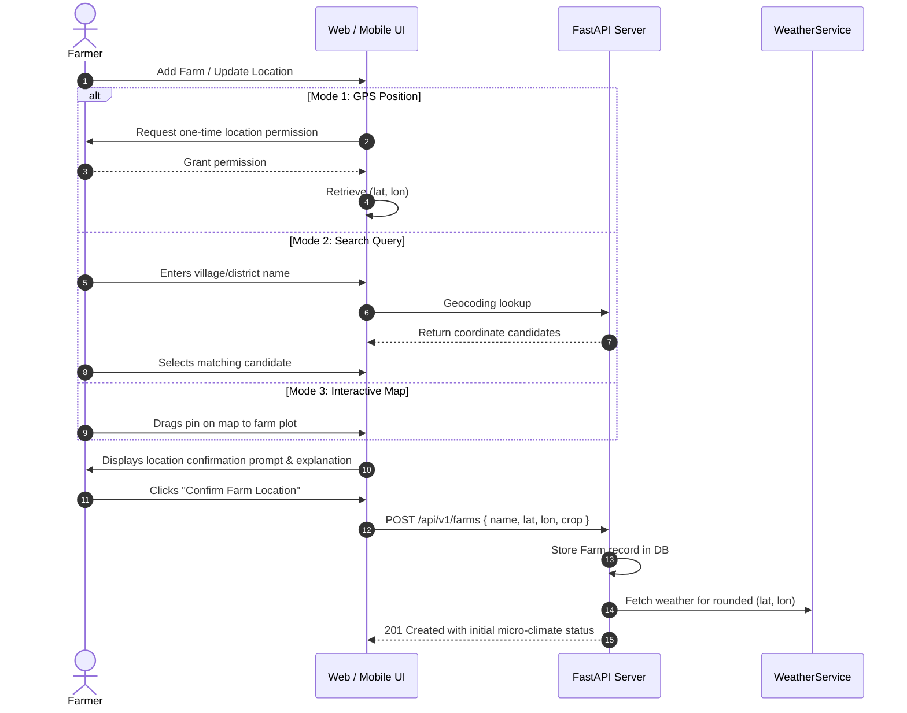
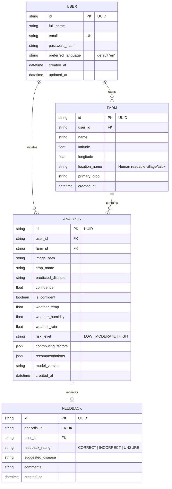
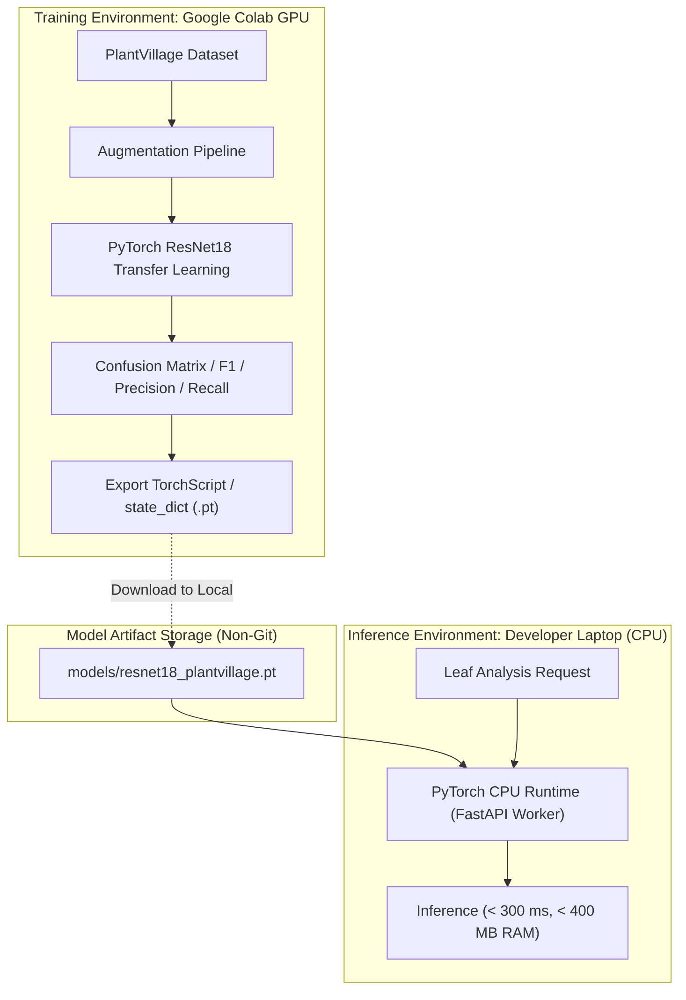
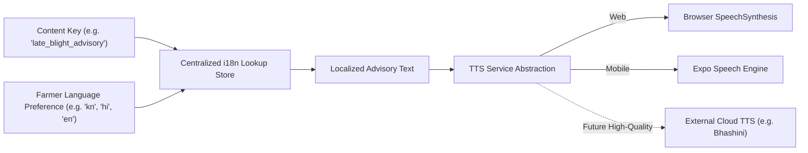

# KrishiSetu AI - System Architecture Document

---

## 1. High-Level Architecture Overview

KrishiSetu AI utilizes a **modular monorepo architecture** featuring a shared **FastAPI backend** that delivers unified RESTful JSON endpoints to both a **Web Client (React + TypeScript + Tailwind CSS)** and a **Mobile Client (React Native + Expo)**.



---

## 2. Frontend / Backend Relationship

### Shared Backend Philosophy
To prevent duplicate business logic, inconsistent disease predictions, and split validation rules, a **single backend** coordinates all intelligence:
- **Consistent Contracts**: Both web and mobile invoke identical endpoints (`/api/v1/analyze`, `/api/v1/farms`, etc.) and receive identical payload schemas.
- **Platform Separation**:
  - Web focuses on rich dashboards, interactive map pickers, and judge/demo exploration.
  - Mobile focuses on direct field camera viewfinder capture, offline-aware prompts, and native audio guidance.
- **Unified Security**: One authentication layer handles farmer accounts, farm profiles, and analysis logs.

---

## 3. Decoupled Machine Learning Architecture

A core architectural principle of KrishiSetu AI is that **Disease Identification** and **Outbreak Risk Assessment** are two strictly separate components answering two distinct questions.



### 3.1 Component 1: Disease Image Classifier ("What is this?")
- **Objective**: Identify the pathogen or physiological disease manifest on the plant leaf.
- **Input**: Raw leaf photograph.
- **Pipeline**:
  1. Image validation (format, dimensions, max size 10MB).
  2. Transform: Resize to $256 \times 256$, Center Crop to $224 \times 224$, Normalize using standard ImageNet mean `[0.485, 0.456, 0.406]` and std `[0.229, 0.224, 0.225]`.
  3. Model Backbone: `ResNet18` pre-trained on ImageNet with customized final classification head matching PlantVillage classes.
  4. Softmax activation produces class probability distribution.
- **Safe Low-Confidence Handling**:
  - If $\max(P(\text{class})) < \tau$ (configurable threshold, default $0.60$), the system **refuses to guess** a disease.
  - Returns status code `LOW_CONFIDENCE` with advice: *"Unable to confidently identify the disease. Please capture a clearer, evenly-lit image of the affected leaf."*

### 3.2 Component 2: Outbreak Risk Engine ("What might happen?")
- **Objective**: Determine whether current and upcoming environmental conditions are conducive to disease proliferation or insect pest migration.
- **Inputs**:
  - Farm geographical coordinates (rounded for privacy).
  - Crop type (e.g., Tomato).
  - Real-time micro-climate indicators (temperature, relative humidity, rainfall, wind speed).
  - Optional disease context from Component 1 (if disease identified).
- **Architecture**:
  - **No Pseudo-Science**: In Phase 0, we explicitly acknowledge that without empirical, multi-year historical pest trap records, claiming a "trained ML pest prediction model" would be hallucination.
  - **Transparent Environmental Baseline Engine**: Employs agronomically grounded micro-climate matrices (e.g., temperature between 20°C–28°C combined with relative humidity > 80% creates a critical window for fungal spore sporulation and blight migration).
- **Outputs**:
  - Categorical Risk: `LOW`, `MODERATE`, or `HIGH`.
  - Environmental Contributing Factors (e.g., *"Persistent relative humidity of 88% creates ideal conditions for late blight sporulation"*).

---

## 4. WeatherService Abstraction Layer

To ensure KrishiSetu AI is not tightly coupled to any single external weather API, weather retrieval is mediated through an extensible abstract interface.



### Abstraction Mechanics
- **Base Interface (`WeatherService`)**: Defines standard async methods returning normalized `WeatherData` dataclasses (temperature, relative humidity, precipitation, wind speed, timestamp).
- **Initial Concrete Implementation (`OpenMeteoWeatherService`)**: Free tier, no API key required for non-commercial evaluation, supports global coordinate lookups.
- **Decorator / Caching Layer (`CachedWeatherService`)**:
  - Coordinates rounded to 2 decimal places (~1.1 km) to form a spatial cache key.
  - TTL (Time To Live): 3600 seconds (1 hour). Prevents redundant external calls when analyzing multiple leaves on the same farm.
- **Resilience & Fallback**:
  - 5-second timeout on outgoing HTTP requests.
  - If the external API fails, the backend catches the error, serves cached data if available, or returns a graceful degradation flag (`weather_available: false`) without failing the primary image diagnosis.

---

## 5. Farm Location Architecture & Privacy

Location is explicitly designed as an attribute of the **Farm**, not a permanent personal tracking attribute of the farmer.



### Location Privacy Guardrails
1. **Zero Continuous Tracking**: The application never queries GPS in the background or during routine leaf capture.
2. **Explicit Transparency**: Farmer is informed upfront: *"KrishiSetu AI uses your farm location to provide local weather and crop-risk information."*
3. **Location Coordinate Obfuscation**: When dispatching queries to external weather APIs, coordinates are truncated to 2–3 decimal places, concealing precise property boundaries.
4. **Isolated Training Policy**: Farm coordinates are **never** injected into computer vision datasets.

---

## 6. Database Architecture & Data Model

The application uses **SQLAlchemy 2.0 ORM** configured for **SQLite** during Phase 0–2 development and fully architected for seamless migration to **PostgreSQL**.



### Table Specifications
1. **`User`**: Core farmer credentials, contact, and localization preferences.
2. **`Farm`**: Physical agricultural plots registered by the farmer. Coordinates are indexed for spatial query efficiency.
3. **`Analysis`**: Historical record of every leaf analysis event, preserving the disease prediction, weather snapshot, risk level, and recommendations.
4. **`Feedback`**: Human-in-the-loop validation entries. Quarantined for periodic research review; **never** automatically triggers real-time model retraining.

---

## 7. Web & Mobile API Contracts

All communication between clients and the backend conforms to standard RESTful JSON conventions.

### Standard Response Envelope
```json
{
  "status": "success",
  "data": {},
  "error": null,
  "timestamp": "2026-09-24T08:50:00Z"
}
```

### Core API Endpoints

| Method | Endpoint | Description | Auth Required |
|---|---|---|---|
| `POST` | `/api/v1/auth/register` | Register new farmer account | No |
| `POST` | `/api/v1/auth/login` | Authenticate & obtain JWT access token | No |
| `GET` | `/api/v1/auth/me` | Fetch active farmer profile & preferences | Yes |
| `GET` | `/api/v1/farms` | List all farms belonging to farmer | Yes |
| `POST` | `/api/v1/farms` | Register a new farm with confirmed location | Yes |
| `POST` | `/api/v1/analyze` | Upload leaf image & trigger disease + risk analysis | Yes |
| `GET` | `/api/v1/history` | Retrieve historical analyses for farmer's farms | Yes |
| `POST` | `/api/v1/feedback` | Submit prediction feedback on an analysis | Yes |
| `GET` | `/api/v1/demo/samples` | Fetch verified sample images for Judge/Demo mode | No |

---

## 8. Training vs. Inference Architecture

Given the developer constraint (**8 GB RAM, no dedicated local GPU**), training and inference are decoupled:



- **Training**: Executed via reproducible scripts and Colab notebooks utilizing NVIDIA T4 GPUs.
- **Inference**: PyTorch loaded in CPU mode using optimized TorchScript or quantized weights. Memory footprint is strictly budgeted to stay under 500 MB RAM during active inference.

---

## 9. Multilingual & Audio Architecture



- **Centralized Dictionary**: No hard-coded UI strings. Keys map to language bundles.
- **Initial Development**: English (`en`) dictionary established in Phase 0–2.
- **Target Indian Languages**: Kannada (`kn`), Hindi (`hi`), Telugu (`te`), Tamil (`ta`), Malayalam (`ml`), Marathi (`mr`), Bengali (`bn`), Gujarati (`gu`), Punjabi (`pa`).
- **TTS Decoupling**: Abstracted voice synthesizer enabling simple toggle between native device TTS and cloud providers.
