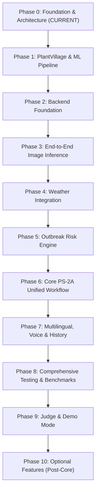

# KrishiSetu AI - Development Roadmap & Checkpoints

---

## Strict Checkpoint Execution Rule
To ensure robust code quality, reliability, and eliminate premature claims, development proceeds through **strictly sequential phases**.

> **MANDATORY CHECKPOINT CRITERIA:**
> No phase may be marked complete, nor may the next phase begin, until:
> 1. All code for the phase executes without runtime errors.
> 2. Automated tests or verification scripts pass.
> 3. Expected behavior is verified and documented.
> 4. Documentation is updated to reflect active reality (not aspirational promises).
> 5. Changes are committed to Git.
> 6. **The User grants explicit approval to advance.**

---

## Phase Overview

---

## Detailed Phase Breakdown

### Phase 0: Requirements + Architecture (CURRENT)
- [x] Establish modular monorepo directory layout (`backend/`, `frontend/`, `mobile/`, `ml/`, `models/`, `data/`, `docs/`).
- [x] Author comprehensive Product Requirements Document (`docs/requirements.md`).
- [x] Author System Architecture Document (`docs/architecture.md`).
- [x] Author Development Roadmap & Checkpoint Specification (`docs/development-roadmap.md`).
- [x] Author root `README.md` and module-level placeholders.
- [x] Configure production-grade `.gitignore` and `.env.example`.
- [ ] **Checkpoint 0 Verification & Approval**.

---

### Phase 1: PlantVillage & ML Training Pipeline
- [ ] Inspect raw PlantVillage dataset distribution, class balancing, and metadata.
- [ ] Implement reproducible PyTorch `Dataset` and `DataLoader` with augmentation (rotation, flips, color jitter).
- [ ] Implement `train.py` transfer learning pipeline utilizing `ResNet18` backbone with cross-entropy loss.
- [ ] Support execution on Google Colab GPU with automated CPU fallback for local testing.
- [ ] Implement `evaluate.py` generating confusion matrix, Accuracy, Precision, Recall, and F1-score.
- [ ] Export trained weights (`resnet18_plantvillage.pt`), `class_mapping.json`, and training metrics report.
- [ ] Document dataset limitations and actual measured validation metrics (anti-hallucination check).
- [ ] **Checkpoint 1 Verification & Approval**.

---

### Phase 2: Shared Backend Foundation
- [ ] Initialize Python FastAPI application skeleton with modular routing (`/api/v1`).
- [ ] Set up SQLAlchemy 2.0 ORM with SQLite database configuration and PostgreSQL readiness.
- [ ] Implement data models: `User`, `Farm`, `Analysis`, `Feedback`.
- [ ] Implement JWT stateless authentication and password hashing (bcrypt).
- [ ] Implement farm management endpoints (`POST /farms`, `GET /farms`) with location validation.
- [ ] Write integration tests for auth and farm registration flows.
- [ ] **Checkpoint 2 Verification & Approval**.

---

### Phase 3: First End-to-End Image Inference
- [ ] Implement `ImageClassifierService` loading `resnet18_plantvillage.pt` on CPU runtime.
- [ ] Implement image preprocessing pipeline in backend (PIL -> PyTorch Tensor).
- [ ] Implement `/api/v1/analyze/image` endpoint accepting multipart file uploads.
- [ ] Implement configurable confidence thresholding ($\tau = 0.60$) and safe low-confidence fallback.
- [ ] Build minimal web upload verification component and mobile camera capture slice.
- [ ] Verify inference latency on developer laptop CPU ($\le 300$ ms).
- [ ] **Checkpoint 3 Verification & Approval**.

---

### Phase 4: Weather Integration
- [ ] Implement `WeatherService` abstract base class and interface.
- [ ] Implement `OpenMeteoWeatherService` concrete adapter.
- [ ] Implement caching layer (`CachedWeatherService`) keyed by rounded farm coordinates (1 hr TTL).
- [ ] Implement timeout (5s) and graceful fallback handling when external weather API is unreachable.
- [ ] Integrate weather lookup into farm overview endpoint (`GET /farms/{id}/weather`).
- [ ] Verify rate-limiting resilience and simulate network failure cases.
- [ ] **Checkpoint 4 Verification & Approval**.

---

### Phase 5: Pest & Outbreak Risk Engine
- [ ] Establish transparent agronomic environmental vulnerability matrix (Temperature + Humidity + Rain thresholds).
- [ ] Implement decoupled `RiskEngine` evaluating micro-climate conditions against pathogen sporulation criteria.
- [ ] Implement risk categorization output (`LOW`, `MODERATE`, `HIGH`) with human-readable contributing factors.
- [ ] Verify risk engine behavior against varying simulated weather profiles (e.g. cold dry vs. warm humid).
- [ ] Document that risk engine is an environmental heuristic baseline, not a trained predictive ML model.
- [ ] **Checkpoint 5 Verification & Approval**.

---

### Phase 6: Complete PS-2A Core Workflow
- [ ] Implement consolidated `/api/v1/analyze` endpoint synthesizing:
  1. Image disease classification.
  2. Farm weather micro-climate fetch.
  3. Outbreak risk calculation.
  4. Contextual targeted intervention guidance.
- [ ] Build complete web analysis dashboard (React + Tailwind CSS).
- [ ] Build complete mobile analysis workflow (React Native + Expo Android).
- [ ] Verify end-to-end user experience on both clients against the identical backend.
- [ ] **Checkpoint 6 Verification & Approval**.

---

### Phase 7: Multilingual, Voice, History & Feedback
- [ ] Implement centralized client i18n localization store supporting regional Indian languages.
- [ ] Implement audio narration ("Listen" button) using device-native speech synthesis abstraction.
- [ ] Implement historical analysis logging in database and client history view (`GET /api/v1/history`).
- [ ] Implement user prediction feedback endpoint (`POST /api/v1/feedback`) with human-in-the-loop quarantine policy.
- [ ] Verify UI readability and voice output in high-contrast sunny conditions.
- [ ] **Checkpoint 7 Verification & Approval**.

---

### Phase 8: Comprehensive Testing & System Validation
- [ ] Execute comprehensive unit test suite across backend, ML inference, and risk logic.
- [ ] Measure end-to-end latency benchmarks on CPU hardware.
- [ ] Perform security and privacy audit (coordinate precision, token security, upload sanitization).
- [ ] Conduct edge case testing (corrupted images, extreme weather values, offline behavior).
- [ ] **Checkpoint 8 Verification & Approval**.

---

### Phase 9: Judge / Demo Mode Preparation
- [ ] Implement dedicated Judge / Demo mode with pre-packaged representative test cases.
- [ ] Build deterministic walkthrough interface allowing evaluation without field photography.
- [ ] Finalize documentation, architecture walkthrough, and local quickstart script.
- [ ] Prepare evaluation presentation materials and slide narrative.
- [ ] **Checkpoint 9 Verification & Approval**.

---

### Phase 10: Optional Features (Post-Core Evaluation Only)
*Note: Commenced strictly if time permits after Core Checkpoints 0–9 pass.*
- Soil care and nutrient guidelines.
- Dynamic irrigation scheduling.
- Crop recommendation algorithms.
- Regional outbreak risk heatmaps.
