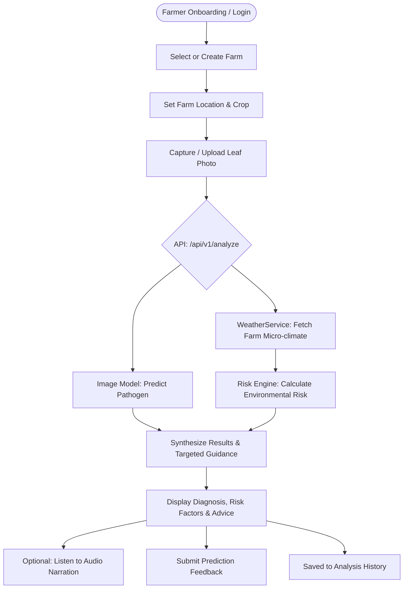

# KrishiSetu AI - Product Requirements Document (PRD)

---

## 1. Problem Statement & Context
**Problem Statement:**
> "Create an image recognition and weather-integrated model to identify leaf pathogens from field photos and predict local pest migration risks to minimize chemical pesticide usage."

Smallholder farmers frequently face severe crop yield loss due to unmanaged leaf pathogens and pest outbreaks. Traditional management often defaults to late diagnosis followed by blanket, calendar-based chemical pesticide spraying. This practice incurs high economic costs for farmers, accelerates chemical resistance, damages non-target beneficial ecosystems, and contaminates local soil and water tables.

### Relevant Sustainable Development Goals (SDGs)
- **SDG 2: Zero Hunger**: Protecting crop yields from premature blight, rot, and pest infestations to bolster food security and farmer livelihoods.
- **SDG 12: Responsible Consumption and Production**: Guiding targeted, judicious interventions rather than indiscriminate blanket pesticide spraying.
- **SDG 13: Climate Action**: Fostering climate-resilient farming practices aligned with changing micro-climatic pest patterns.
- **SDG 15: Life on Land**: Preserving biodiversity, soil health, and beneficial pollinator populations by curbing chemical runoff.

### Core Objectives
1. **Early Detection**: Identify crop diseases and foliar pathogens rapidly from field photos captured via smartphones.
2. **Environmental Intelligence**: Integrate hyper-local weather and environmental indicators for the farmer's specific farm.
3. **Early Risk Prediction**: Assess local pest and disease outbreak vulnerability by combining micro-climatic parameters with biological risk indicators.
4. **Targeted Intervention**: Deliver simple, actionable, and timely guidance designed to help farmers respond early, avoiding unnecessary blanket chemical spraying.

> **CRITICAL SCIENTIFIC & ETHICAL DISCLAIMER:**
> The system must **never claim** that it has reduced chemical pesticide usage until empirical, real-world field validation data is rigorously gathered and verified. All UI screens, documentation, and promotional materials must present the system as an early-warning advisory and decision-support tool.

---

## 2. Scope: Core Features vs. Optional Features

To ensure timely and reliable delivery within the hackathon timeline, feature boundaries are strictly enforced.

### 2.1 Core Features (Mandatory Checkpoint Scope)
The following capabilities represent the non-negotiable core:
1. **Farmer Account & Authentication**: User registration, login, secure session token handling (JWT), and language preference storage.
2. **Farm Management**: Create, view, and manage farms belonging to the farmer profile.
3. **Farm Location Selection**: Capture farm location via (a) GPS "Use My Location", (b) manual location search, or (c) map pin selection, with explicit farmer confirmation.
4. **Crop Selection**: Association of specific crops (e.g., Tomato, Potato, Pepper) with the farm profile and analysis session.
5. **Field Image Upload & Camera Capture**: Camera capture on mobile, file upload / drag-and-drop on web.
6. **Disease / Pathogen Image Classification**: PyTorch-based neural classifier trained on the official PlantVillage dataset.
7. **Safe Low-Confidence Handling**: Configurable thresholding to reject uncertain predictions and prompt for re-capture.
8. **Pluggable Weather Integration**: Real-time micro-climate retrieval (temperature, humidity, precipitation, wind) through a generic `WeatherService` abstraction (initial candidate: Open-Meteo).
9. **Pest & Outbreak Risk Assessment**: Explicitly decoupled environmental risk engine calculating outbreak vulnerability scores from weather factors.
10. **Contributing Environmental Risk Factors**: Clear, human-readable breakdown of *why* risk is high or low (e.g., high humidity + persistent warm temperature).
11. **Targeted Guidance & Non-Blanket Advice**: Specific cultural, biological, and localized physical interventions.
12. **Historical Analysis Records**: Persistent log of previous diagnoses and farm evaluations.
13. **Farmer Feedback Loop**: User submission of prediction feedback ("Correct", "Incorrect", "Unsure") with human-in-the-loop review architecture.
14. **Multilingual Foundation**: Centralized i18n architecture supporting 10 Indian regional languages (English initial, extensible).
15. **Voice / TTS Narration**: Audio playback ("Listen") option for diagnoses and advice.
16. **Shared Backend**: Unified Python FastAPI backend serving both Web and Mobile clients with identical JSON schemas.
17. **Web Client**: Responsive React + TypeScript + Tailwind CSS web application.
18. **Mobile Client**: React Native + Expo Android mobile application.
19. **Privacy & Data Security**: Strict coordinates protection, zero background tracking, sanitized data handling.
20. **Reproducible ML Pipeline**: Google Colab GPU-ready training scripts with local CPU fallback.
21. **Judge / Demo Mode**: Deterministic walkthrough mode with pre-loaded sample imagery and mock scenarios for hackathon evaluation.

### 2.2 Optional Features (Explicitly Out-of-Scope for Core Delivery)
The following features are **strictly deferred** until all core checkpoints pass validation:
- Soil nutrient care & NPK sensor integration
- Dynamic irrigation scheduling recommendations
- Crop recommendation algorithms
- Crop yield prediction
- IoT field hardware and telemetry streaming
- Physical pheromone trap vision monitoring
- Regional live disease heatmaps
- Expert / Agronomist marketplace & direct chat
- Generative AI conversational chatbot / LLM agronomist
- Advanced agricultural supply-chain analytics

---

## 3. User Personas

| Persona | Role | Primary Needs | Key Device / Environment |
|---|---|---|---|
| **Farmer (Ramesh)** | Smallholder Cultivator | Rapid leaf diagnosis, local rain/pest warnings, voice guidance in native language | Low-to-mid range Android phone, sunny field conditions, variable 3G/4G connectivity |
| **Field Extension Worker (Anita)** | Village Agriculture Officer | Rapidly assesses multiple farms, cross-checks symptoms, provides printed/digital summaries | Android tablet or laptop web browser |
| **Judge / Evaluator** | Hackathon Assessment Committee | Verifies architectural integrity, tests live inference, reviews reproducible training pipeline, examines risk engine logic | Desktop / Laptop web browser, inspection of codebase |
| **System Admin / Researcher** | Model Developer | Evaluates test accuracy, audits user feedback, monitors API latency and weather caching | Developer workstation / Google Colab |

---

## 4. User Workflows

### Workflow 1: Farm Location & Setup
1. Farmer logs into KrishiSetu AI.
2. Selects "Add Farm" or chooses existing farm.
3. Chooses location via:
   - "Use Current Location" (requests one-time location permission).
   - "Search Location" (text query for village/taluk/district).
   - "Pick on Map" (drags pin to exact field).
4. System clearly displays: *"KrishiSetu AI uses your farm location to provide local weather and crop-risk information."*
5. Farmer explicitly clicks **Confirm Farm Location**.
6. Farmer selects active crops cultivated on the plot.

### Workflow 2: Leaf Image Capture & Disease Identification
1. Farmer selects "Analyze Leaf".
2. Takes a clear photograph of a symptomatic leaf using the camera (or uploads on web).
3. The client sends a multipart request to the backend.
4. If image confidence is below the threshold ($\tau < 0.60$), the system returns a safe fallback:
   *"Unable to confidently identify the disease. Please capture a clearer, well-lit image of the affected leaf."*
5. If confidence is sufficient, the system returns the disease name, confidence percentage, and brief pathogen overview.

### Workflow 3: Environmental Weather & Outbreak Risk Evaluation
1. Concurrently with image analysis, the backend queries the `WeatherService` using the confirmed farm coordinates.
2. The `WeatherService` fetches current temperature, relative humidity, wind speed, and precipitation (using cached data if fresh).
3. The `RiskEngine` evaluates environmental vulnerability thresholds (e.g., Temperature between 20°C–28°C and Humidity > 80% creates high fungal spore germination risk).
4. The system calculates a categorized Risk Level (**Low**, **Moderate**, **High**) along with explicit contributing factors.

### Workflow 4: Targeted Guidance & Audio Playback
1. The system displays concise cultural and biological mitigation steps (e.g., pruning infected foliage, improving furrow drainage, monitoring underside of adjacent leaves).
2. Farmer taps the **"Listen"** button to hear the diagnosis, risk assessment, and steps in their preferred regional language.

### Workflow 5: Feedback Submission
1. Farmer reviews the diagnosis and selects **"Correct"**, **"Incorrect"**, or **"Not Sure"**.
2. Optional text comments or corrected disease suggestion may be provided.
3. Submission is logged in the `Feedback` table for offline human curation.

---

## 5. Functional Requirements (FR)

### 5.1 Authentication & Profile
- **FR-AUTH-01**: User registration with email/phone, password, full name, and preferred language.
- **FR-AUTH-02**: Passwords hashed using standard cryptographic algorithms (bcrypt / Argon2).
- **FR-AUTH-03**: Secure JWT token generation upon login, passed via HTTP Authorization header (`Bearer <token>`).
- **FR-AUTH-04**: Session persistence and token refresh mechanism.

### 5.2 Farm & Location Management
- **FR-FARM-01**: Farmer can register multiple distinct farm holdings.
- **FR-FARM-02**: Location belongs to the **Farm entity**, not permanently bound to the user profile.
- **FR-FARM-03**: Support 3 location acquisition strategies:
  1. GPS current position (with explicit prompt).
  2. Manual search (geocoding text lookup).
  3. Interactive map coordinate selection.
- **FR-FARM-04**: Mandatory farmer confirmation dialog before saving coordinates.
- **FR-FARM-05**: Association of one or more crops with the farm.

### 5.3 Disease Classification (Image Model)
- **FR-ML-01**: Image ingest supporting standard formats (`JPEG`, `PNG`, `WEBP`) up to 10 MB.
- **FR-ML-02**: Preprocessing pipeline: resize to $224 \times 224$, RGB conversion, tensor normalization.
- **FR-ML-03**: Inference execution on PyTorch model (`ResNet18` backbone).
- **FR-ML-04**: Configurable confidence threshold (default: $0.60$).
- **FR-ML-05**: If confidence is below threshold, output safe refusal message and capture guidance.
- **FR-ML-06**: Return top predicted class, confidence score, and top-3 secondary probabilities when requested.

### 5.4 Weather Integration
- **FR-WX-01**: Generic `WeatherService` interface decoupling external APIs from application logic.
- **FR-WX-02**: Initial implementation candidate using Open-Meteo REST API.
- **FR-WX-03**: In-memory / database caching of weather responses indexed by geo-hash / rounded lat-long (1-hour TTL).
- **FR-WX-04**: Resilient timeout (5–10s) and fallback handling if weather API is unreachable.
- **FR-WX-05**: Extraction of temperature (°C), relative humidity (%), precipitation probability / mm, and wind speed (km/h).

### 5.5 Pest & Disease Outbreak Risk Engine
- **FR-RISK-01**: Risk engine must be architecturally independent of the image classification model.
- **FR-RISK-02**: Transparent rule-based and environmental indicator matrix for pest/disease proliferation.
- **FR-RISK-03**: Generation of a categorical risk score: `LOW`, `MODERATE`, `HIGH`.
- **FR-RISK-04**: Generation of structured contributing factors (e.g., `["Persistent humidity > 85% for 48 hrs", "Favorable temperature range (22-26°C) for fungal sporulation"]`).
- **FR-RISK-05**: Output must never claim to be an empirical predictive machine learning model unless verified historical outbreak data is provided.

### 5.6 Targeted Guidance & Interventions
- **FR-REC-01**: Contextual recommendation database keyed by `(Crop, Disease, RiskLevel)`.
- **FR-REC-02**: Primary emphasis on non-chemical, targeted cultural and mechanical tactics (pruning, rogueing, spacing, water regulation).
- **FR-REC-03**: Clear guidance against prophylactic blanket chemical spraying.

### 5.7 History & Feedback
- **FR-HIST-01**: Persist each completed analysis session with timestamp, image reference, prediction, weather snapshot, and risk evaluation.
- **FR-HIST-02**: Farmer can view historical analyses chronologically.
- **FR-FDBK-01**: Farmer can submit rating/feedback on any historical diagnosis.
- **FR-FDBK-02**: Feedback is quarantined for research review and **never** immediately auto-triggers model retraining.

### 5.8 Multilingual & Voice
- **FR-I18N-01**: Centralized key-value localization store.
- **FR-I18N-02**: Initial support for English, designed for straightforward addition of Kannada, Hindi, Telugu, Tamil, Malayalam, Marathi, Bengali, Gujarati, and Punjabi.
- **FR-TTS-01**: Audio narration capability for diagnosis and guidance cards via browser/native TTS abstraction.

### 5.9 Judge & Demo Mode
- **FR-DEMO-01**: Dedicated demo toggle enabling deterministic evaluation using verified sample test cards.
- **FR-DEMO-02**: Instant loading of sample leaf images without requiring field capture.

---

## 6. Non-Functional Requirements (NFR)

### 6.1 Performance & Hardware Constraints
- **NFR-PERF-01**: Developer workstation constraint: 8 GB RAM, no dedicated local GPU. All local inference must execute smoothly on CPU within 500 ms.
- **NFR-PERF-02**: End-to-end API response time (Image analysis + Weather lookup + Risk scoring) under 2.0 seconds on standard broadband / 4G connections.
- **NFR-PERF-03**: Peak memory footprint of FastAPI process during inference $\le 1.2$ GB.

### 6.2 Availability & Resilience
- **NFR-REL-01**: Graceful degradation: If weather API fails or times out, image disease diagnosis must still succeed with a notice: *"Weather risk currently unavailable."*
- **NFR-REL-02**: If the client is offline, mobile and web apps must display informative connectivity banners rather than crashing.

### 6.3 Usability & Accessibility
- **NFR-UI-01**: Sunlight-readable UI theme with high-contrast elements suitable for outdoors.
- **NFR-UI-02**: Touch targets $\ge 48 \times 48$ dp on mobile for ease of operation by farmers.
- **NFR-UI-03**: Audio "Listen" feature prominently displayed alongside complex textual advice.

---

## 7. Privacy, Security & Ethics Requirements

### 7.1 Location Privacy
- **SEC-LOC-01**: Farm coordinates are classified as sensitive farmer data.
- **SEC-LOC-02**: Coordinates are never broadcast, logged in public endpoints, or rendered in unauthenticated payloads.
- **SEC-LOC-03**: Coordinates are rounded to 3 decimal places (~110m precision) when querying external weather services to prevent micro-location leakage.
- **SEC-LOC-04**: Zero continuous or background location tracking. Geolocation APIs are queried strictly upon on-demand user action.

### 7.2 Image & Data Governance
- **SEC-DAT-01**: Farmer-uploaded field images are stored with randomized UUID filenames in a non-public upload directory.
- **SEC-DAT-02**: Farmer images are **strictly barred** from automatic ingestion into training datasets without affirmative, documented consent and human curation.
- **SEC-DAT-03**: No personally identifiable information (PII) is embedded in model checkpoints, metadata, or logs.

### 7.3 Model Ethics & Truth in Advertising
- **ETH-01**: The system shall not generate claims of "guaranteed pesticide reduction" or "100% cure".
- **ETH-02**: Disclaimer must be present on every diagnosis:
  *"KrishiSetu AI is an assistive decision-support tool. For severe or extensive crop blight, consult your local Krishi Vigyan Kendra (KVK) or agricultural extension officer."*

---

## 8. Anti-Hallucination & Verification Checklist

To maintain rigorous engineering standards, the following table tracks what is verified vs. unverified at Phase 0:

| Item | Status | Action Plan |
|---|---|---|
| PlantVillage Dataset Statistics | **To be verified during Phase 1** | Inspect actual download archive, count classes and images via script before citing numbers |
| ResNet18 Transfer Learning Accuracy | **To be verified during Phase 1** | Document actual validation split accuracy after Colab training run |
| Weather Provider API Quota & Latency | **To be verified during Phase 4** | Validate Open-Meteo rate limits (e.g. 10k calls/day) and test response latency |
| Historical Pest Outbreak Datasets | **To be verified during Phase 5** | Default to transparent environmental threshold risk engine unless official dataset is provided |
| Regional Indian Language TTS Engine | **To be verified during Phase 7** | Benchmark native Web Speech API vs Expo Speech vs external cloud TTS |
